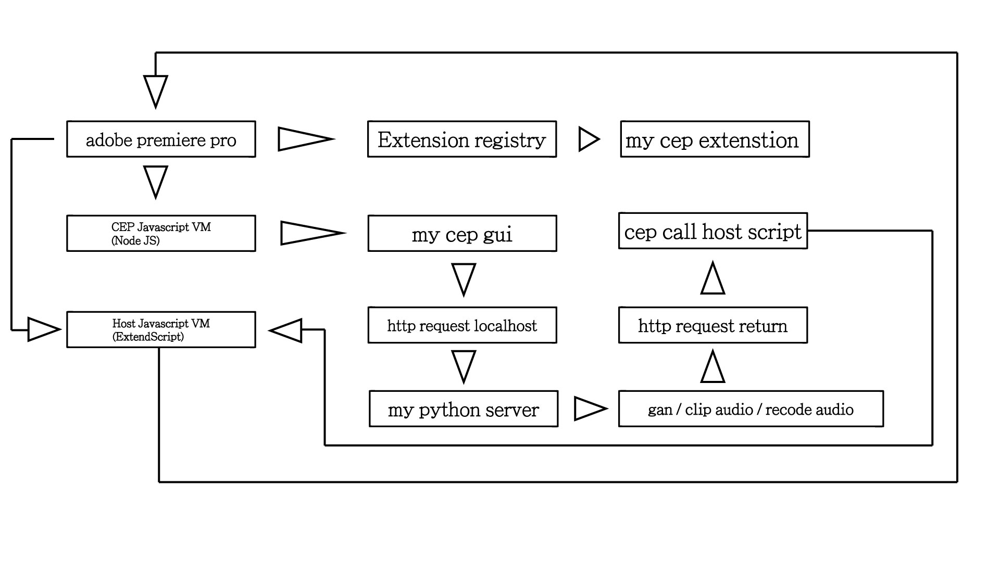

## This is adobe premiere pro script for LJMedia.

auto injection Tensorflow output in adobe premiere pro.


## How this work




## compiler

### create signed key

```bash
bin/ZXPSignCmd.exe -selfSignedCert <countryCode> <stateOrProvince> <organization> <commonName> <password> <outputPath.p12> [options]
```

### build

```bash
bin/ZXPSignCmd.exe -sign "../extensionSource" myExt.zxp myCert.p12 myPassword123
```
